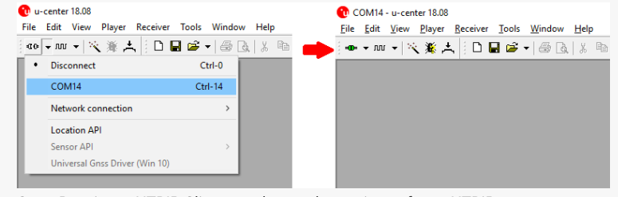

# raspi-gps-logger
	1) Configure simple RTK2B using UBX: Enable the receiver to receive RAW logs
		a. Connect RTK2B to windows PC (via USB) which has u-center installed.
		b. Open u-center and choose appropriate COM port so that the connection with RTK is established.
	
	
	
		
		a. Enable UBX-RXM-RAWX and UBX-RXM-SFRBX from Ucentre

	

	2) Setup Raspi to create a mount point and map USB to it. Needs improvement

	Copy mountusb.py module in /home/pi/Desktop/source_code

	3)  Install rtklib and setup log collection script.

		a. Download rtklib_2.4.2 software and copy to "/home/pi/Desktop/rtklib"
		b. Copy collectLogStr2str.sh "/home/pi/Desktop/source_code"

	4) Enable  myscript.service which invokes collectLogStr2str.sh at boot time.
	
		    sudo cp  myscript.service /etc/systemd/system/myscript.service
		    sudo systemctl enable  myscript.service
		    sudo systemctl start  myscript.service  //should complete without errors.
		

	5) Attach the button as shown below.
		a.  The pins used on Raspberry pi is GPIO 27 and any of  the nearest ground pin. 
	
	6) Setup  shutdown_button  to gracefully stop log collection and reboot /shutdown the system.
		a. Copy the folder shutdown_button_master on desktop and move shutdown_button.py  to "/usr/local/bin"
			
			    sudo apt install python3-gpiozero
			    sudo mkdir -p /usr/local/bin
			    cd  /home/pi/Desktop/shutdown_button_master
			    chmod +x shutdown_button.py
			   
		b. Enable Shutdown_button_service
			   
			#copy shutdown_button.py t0 /usr/local/bin
			    sudo cp shutdown_button.py /usr/local/bin
			# enable shutdown button service
			    sudo cp shutdown_button.service /etc/systemd/system/shutdown_button.service
			    sudo systemctl enable shutdown_button.service
			    sudo systemctl start shutdown_button.service. // Should complete without errors.

